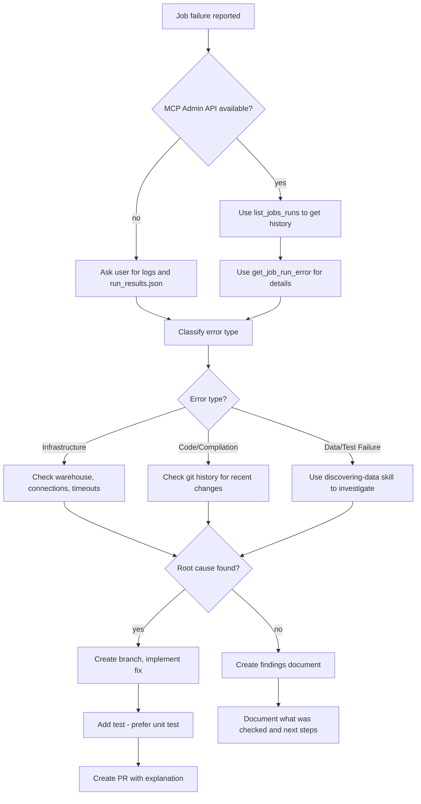

# Troubleshooting dbt Job Errors

Systematically diagnose and resolve dbt Cloud job failures using available MCP tools, CLI commands, and data investigation.

## When to Use

- dbt Cloud job failed and you need to find the root cause
- Intermittent job failures that are hard to reproduce
- Error messages that don't clearly indicate the problem
- Post-merge failures where a recent change may have caused the issue

**Not for:** Local dbt development errors - use `debugging-dbt-errors` skill instead

## The Iron Rule

**Never modify a test to make it pass without understanding why it's failing.**

A failing test is evidence of a problem. Changing the test to pass hides the problem. Investigate the root cause first.

## Rationalizations That Mean STOP

| You're Thinking... | Reality |
|-------------------|---------|
| "Just make the test pass" | The test is telling you something is wrong. Investigate first. |
| "There's a board meeting in 2 hours" | Rushing to a fix without diagnosis creates bigger problems. |
| "We've already spent 2 days on this" | Sunk cost doesn't justify skipping proper diagnosis. |
| "The DBAs say the warehouse is fine" | The issue might be how dbt uses the warehouse, not the warehouse itself. |
| "I'll just update the accepted values" | Are the new values valid business data or bugs? Verify first. |
| "It's probably just a flaky test" | "Flaky" means there's a timing/data issue. Find it. |

## Workflow



## Step 1: Gather Job Run Information

### If dbt MCP Server Admin API Available

Use these tools first - they provide the most comprehensive data:

| Tool | Purpose |
|------|---------|
| `list_jobs_runs` | Get recent run history, identify patterns |
| `get_job_run_error` | Get detailed error message and context |

```
# Example: Get recent runs for job 12345
list_jobs_runs(job_id=12345, limit=10)

# Example: Get error details for specific run
get_job_run_error(run_id=67890)
```

### Without MCP Admin API

**Ask the user to provide these artifacts:**

1. **Job run logs** from dbt Cloud UI (Debug logs preferred)
2. **`target/run_results.json`** - contains execution status for each node
3. **`logs/dbt.log`** - detailed execution logs with timestamps

Example request:
> "I don't have access to the dbt MCP server. Could you provide the following from the failed job run:
> 1. The debug logs from dbt Cloud (Job Run → Logs → Download)
> 2. The `run_results.json` file from the target directory
> 3. The `dbt.log` file from the logs directory (if available)"

## Step 2: Classify the Error

| Error Type | Indicators | Primary Investigation |
|------------|-----------|----------------------|
| **Infrastructure** | Connection timeout, warehouse error, permissions | Check warehouse status, connection settings, thread count |
| **Code/Compilation** | Undefined macro, syntax error, parsing error | Check git history for recent changes, use LSP tools |
| **Data/Test Failure** | Test failed with N results, schema mismatch | Use `discovering-data` skill to query actual data |

## Step 3: Investigate Root Cause

### For Infrastructure Errors

1. Check job configuration (thread count, timeout settings)
2. Review warehouse connection limits
3. Look for concurrent jobs competing for resources
4. Check if failures correlate with time of day or data volume

### For Code/Compilation Errors

1. **Check git history for recent changes:**

   If you're not in the dbt project directory, use the dbt MCP server to find the repository:
   ```
   # Get project details including repository URL
   get_project_details(project_id=<project_id>)
   ```

   Then either:
   - Query the repository directly using `gh` CLI if it's on GitHub
   - Clone to a temporary folder: `git clone <repo_url> /tmp/dbt-investigation`

   Once in the project directory:
   ```bash
   git log --oneline -20
   git diff HEAD~5..HEAD -- models/ macros/
   ```

2. **Use dbt CLI/LSP tools if available:**
   ```bash
   dbt parse          # Check for parsing errors
   dbt compile --select failing_model  # Check compilation
   ```

3. **Search for the error pattern:**
   - Find where the undefined macro/model should be defined
   - Check if a file was deleted or renamed

### For Data/Test Failures

**Use the `discovering-data` skill to investigate the actual data.**

1. **Query the failing test's underlying data:**
   ```bash
   dbt show --inline "SELECT status, COUNT(*) FROM {{ ref('orders') }} GROUP BY 1" --output json
   ```

2. **Check for unexpected values:**
   ```bash
   dbt show --inline "SELECT * FROM {{ ref('orders') }} WHERE status NOT IN ('pending', 'shipped', 'delivered')" --output json
   ```

3. **Compare to recent git changes:**
   - Did a transformation change introduce new values?
   - Did upstream source data change?

## Step 4: Resolution

### If Root Cause Is Found

1. **Create a new branch:**
   ```bash
   git checkout -b fix/job-failure-<description>
   ```

2. **Implement the fix** addressing the actual root cause

3. **Add a test to prevent recurrence:**
   - **Prefer unit tests** for logic issues
   - Use data tests for data quality issues
   - Example unit test for transformation logic:
   ```yaml
   unit_tests:
     - name: test_status_mapping
       model: orders
       given:
         - input: ref('stg_orders')
           rows:
             - {status_code: 1, expected_status: 'pending'}
             - {status_code: 2, expected_status: 'shipped'}
       expect:
         rows:
           - {status: 'pending'}
           - {status: 'shipped'}
   ```

4. **Create a PR** with:
   - Description of the issue
   - Root cause analysis
   - How the fix resolves it
   - Test coverage added

### If Root Cause Is NOT Found

**Do not guess. Create a findings document.**

Create `docs/investigations/job-failure-<date>.md`:

```markdown
# Job Failure Investigation: <Job Name>

**Date:** YYYY-MM-DD
**Job ID:** <id>
**Status:** Unresolved

## Summary
Brief description of the failure and symptoms.

## What Was Checked

### Tools Used
- [ ] list_jobs_runs - findings
- [ ] get_job_run_error - findings
- [ ] git history - findings
- [ ] Data investigation - findings

### Hypotheses Tested
| Hypothesis | Evidence | Result |
|------------|----------|--------|
| Connection timeout due to high thread count | Thread count is 4, within limits | Ruled out |
| Recent code change | No changes to affected models in 7 days | Ruled out |

## Patterns Observed
- Failures occur between 2-4 AM (peak load time?)
- Always fails on model X

## Suggested Next Steps
1. [ ] Monitor next 10 runs with detailed logging
2. [ ] Engage warehouse vendor support
3. [ ] Consider splitting job into smaller batches

## Related Resources
- Link to job run logs
- Link to relevant documentation
```

Commit this document to the repository so findings aren't lost.

## Quick Reference

| Task | Tool/Command |
|------|--------------|
| Get job run history | `list_jobs_runs` (MCP) |
| Get detailed error | `get_job_run_error` (MCP) |
| Check recent git changes | `git log --oneline -20` |
| Parse project | `dbt parse` |
| Compile specific model | `dbt compile --select model_name` |
| Query data | `dbt show --inline "SELECT ..." --output json` |
| Run specific test | `dbt test --select test_name` |

## Common Mistakes

**Modifying tests to pass without investigation**
- A failing test is a signal, not an obstacle. Understand WHY before changing anything.

**Skipping git history review**
- Most failures correlate with recent changes. Always check what changed.

**Not documenting when unresolved**
- "I couldn't figure it out" leaves no trail. Document what was checked and what remains.

**Making best-guess fixes under pressure**
- A wrong fix creates more problems. Take time to diagnose properly.

**Ignoring data investigation for test failures**
- Test failures often reveal data issues. Query the actual data before assuming code is wrong.
