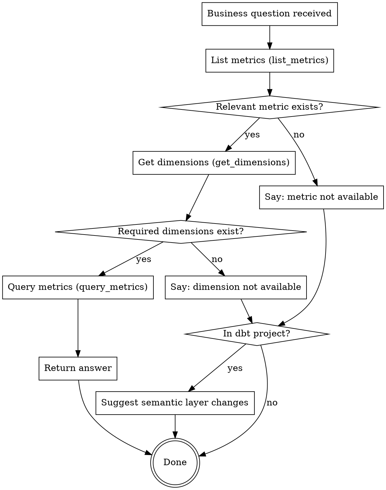

# dbt Semantic Layer Queries

## Overview

Answer business questions using dbt Semantic Layer MCP tools. If the question cannot be answered with current configuration, say so clearly and suggest semantic layer changes if in a dbt project.

## Workflow

## Quick Reference

| Step | Tool | Purpose |
|------|------|---------|
| 1 | `list_metrics` | Find relevant metrics |
| 2 | `get_dimensions` | Check available dimensions for those metrics |
| 3 | `get_entities` | Check available entities if grouping by business objects |
| 4 | `query_metrics` | Execute the query |

## When You Cannot Answer

**Be upfront.** Start with the limitation, then explain:

> "This question cannot be answered with the current semantic layer configuration. The `total_premium` metric exists, but there is no `state` dimension available."

This includes when:
- A metric doesn't exist
- A required dimension doesn't exist
- A dimension exists but query returns null/empty values (treat as "cannot answer")

**Do NOT:**
- Bury the finding in paragraphs of exploration details
- Suggest database/ETL fixes ("populate this field", "data engineering team should...")
- Discuss underlying table structures

**Stay at the semantic layer level.** The semantic layer abstracts the database—your suggestions should too.

## Suggesting Changes (dbt Projects Only)

**First, detect if in a dbt project:**
- Look for `dbt_project.yml` in the workspace
- If not found, do NOT suggest changes—just report the limitation

**If in a dbt project, suggest semantic layer changes:**

| Missing | Suggestion |
|---------|------------|
| Metric | "Add a new metric definition to a semantic model" |
| Dimension | "Add the dimension to the semantic model's dimensions list" |
| Entity | "Add an entity relationship to connect the required data" |

**Example suggestion:**
> "To answer 'total premium by state', you would need to add a `state` dimension to the semantic model that defines `total_premium`. This typically involves adding the dimension to the `dimensions:` section of the semantic model YAML."

Do NOT specify exact file paths or write the YAML—that's a separate task.

## Not a Data Question?

If the question is about dbt configuration, documentation, or concepts (not querying data), do NOT use semantic layer tools. Answer from general knowledge or suggest documentation resources.
