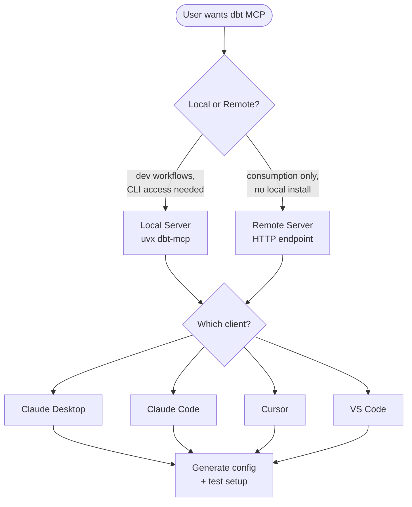

# Configure dbt MCP Server

## Overview

The dbt MCP server connects AI tools to dbt's CLI, Semantic Layer, Discovery API, and Admin API. This skill guides users through setup with the correct configuration for their use case.

## Decision Flow



## Questions to Ask

### 1. Server Type
**Ask:** "Do you want to use the **local** or **remote** dbt MCP server?"

| Local Server                                                                                                                                             | Remote Server                                               |
| -------------------------------------------------------------------------------------------------------------------------------------------------------- | ----------------------------------------------------------- |
| Runs on your machine via `uvx`                                                                                                                           | Connects via HTTP to dbt platform                           |
| Required for development (authoring models, tests, docs) but can also connect to the dbt platform for consumption (querying metrics, exploring metadata) | Best for consumption (querying metrics, exploring metadata) |
| Supports dbt CLI commands (run, build, test, show)                                                                                                       | No CLI commands (run, build, test)                          |
| Works without a dbt platform account but can also connect to the dbt platform for development (authoring models, tests, docs)                            | Requires dbt platform account                               |
| No credit consumption                                                                                                                                    | Consumes dbt Copilot credits                                |

### 2. MCP Client
**Ask:** "Which MCP client are you using?"
- Claude Desktop
- Claude Code (CLI)
- Cursor
- VS Code

### 3. Use Case (Local Server Only)
**Ask:** "What's your use case?"

| CLI Only | Platform Only | Platform + CLI |
|----------|---------------|----------------|
| dbt Core/Fusion users | dbt Cloud without local project | Full access to both |
| No platform account needed | OAuth or token auth | Requires paths + credentials |

### 4. Tools to Enable
**Ask:** "Which tools do you want enabled?" (show defaults)

| Tool Category | Default | Environment Variable |
|---------------|---------|---------------------|
| dbt CLI (run, build, test, compile) | Enabled | `DISABLE_DBT_CLI=true` to disable |
| Semantic Layer (metrics, dimensions) | Enabled | `DISABLE_SEMANTIC_LAYER=true` to disable |
| Discovery API (models, lineage) | Enabled | `DISABLE_DISCOVERY=true` to disable |
| Admin API (jobs, runs) | Enabled | `DISABLE_ADMIN_API=true` to disable |
| SQL (text_to_sql, execute_sql) | **Disabled** | `DISABLE_SQL=false` to enable |
| Codegen (generate models/sources) | **Disabled** | `DISABLE_DBT_CODEGEN=false` to enable |

## Prerequisites

### Local Server
1. **Install `uv`**: https://docs.astral.sh/uv/getting-started/installation/
2. **Have a dbt project** (for CLI commands)
3. **Find paths:**
   - `DBT_PROJECT_DIR`: Folder containing `dbt_project.yml`
     - macOS/Linux: `pwd` from project folder
     - Windows: Full path with forward slashes (e.g., `C:/Users/name/project`)
   - `DBT_PATH`: Path to dbt executable
     - macOS/Linux: `which dbt`
     - Windows: `where dbt`

### Remote Server
1. **dbt Cloud account** with AI features enabled
2. **Production environment ID** (from Orchestration page)
3. **Personal access token** or service token

See [How to Find Your Credentials](references/finding-credentials.md) for detailed guidance on obtaining tokens and IDs.

## Credential Security

- Always use environment variable references (e.g., `${DBT_TOKEN}`) instead of literal token values in configuration files that may be committed to version control
- Never log, display, or echo token values in terminal output
- When using `.env` files, ensure they are added to `.gitignore` to prevent accidental commits
- Recommend users rotate tokens regularly and use the minimum required permission set

## Configuration Templates

### Local Server - CLI Only

```json
{
  "mcpServers": {
    "dbt": {
      "command": "uvx",
      "args": ["dbt-mcp"],
      "env": {
        "DBT_PROJECT_DIR": "/path/to/your/dbt/project",
        "DBT_PATH": "/path/to/dbt"
      }
    }
  }
}
```

### Local Server - Platform + CLI (OAuth)

```json
{
  "mcpServers": {
    "dbt": {
      "command": "uvx",
      "args": ["dbt-mcp"],
      "env": {
        "DBT_HOST": "https://your-subdomain.us1.dbt.com",
        "DBT_PROJECT_DIR": "/path/to/project",
        "DBT_PATH": "/path/to/dbt"
      }
    }
  }
}
```

### Local Server - Platform + CLI (Token Auth)

```json
{
  "mcpServers": {
    "dbt": {
      "command": "uvx",
      "args": ["dbt-mcp"],
      "env": {
        "DBT_HOST": "cloud.getdbt.com",
        "DBT_TOKEN": "your-token",
        "DBT_ACCOUNT_ID": "your-account-id",
        "DBT_PROD_ENV_ID": "your-prod-env-id",
        "DBT_PROJECT_DIR": "/path/to/project",
        "DBT_PATH": "/path/to/dbt"
      }
    }
  }
}
```

### Local Server - Using .env File

```json
{
  "mcpServers": {
    "dbt": {
      "command": "uvx",
      "args": ["--env-file", "/path/to/.env", "dbt-mcp"]
    }
  }
}
```

**.env file contents:**
```
DBT_HOST=cloud.getdbt.com
DBT_TOKEN=your-token
DBT_ACCOUNT_ID=your-account-id
DBT_PROD_ENV_ID=your-prod-env-id
DBT_DEV_ENV_ID=your-dev-env-id
DBT_USER_ID=your-user-id
DBT_PROJECT_DIR=/path/to/project
DBT_PATH=/path/to/dbt
```

### Remote Server

```json
{
  "mcpServers": {
    "dbt": {
      "url": "https://cloud.getdbt.com/api/ai/v1/mcp/",
      "headers": {
        "Authorization": "Token your-token",
        "x-dbt-prod-environment-id": "your-prod-env-id"
      }
    }
  }
}
```

**Additional headers for SQL/Fusion tools:**
```json
{
  "headers": {
    "Authorization": "Token your-token",
    "x-dbt-prod-environment-id": "your-prod-env-id",
    "x-dbt-dev-environment-id": "your-dev-env-id",
    "x-dbt-user-id": "your-user-id"
  }
}
```

## Client-Specific Setup

### Claude Desktop
1. Click **Claude menu** in system menu bar (not in-app)
2. Select **Settings...**
3. Go to **Developer** tab
4. Click **Edit Config**
5. Add the JSON configuration
6. Save and restart Claude Desktop
7. **Verify:** Look for MCP server indicator in bottom-right of input box

**Config location:**
- macOS: `~/Library/Application Support/Claude/claude_desktop_config.json`
- Windows: `%APPDATA%\Claude\claude_desktop_config.json`

### Claude Code (CLI)
Run:
```bash
claude mcp add dbt -s user -- uvx dbt-mcp
```
This adds the server to your user scope/config (on this system: `~/.claude.json`).

For a project-specific setup, run:
```bash
claude mcp add dbt -s project -- uvx dbt-mcp
```
This adds the server to `.mcp.json` in your project root.

Alternatively, you can use the manual configuration below.

**Manual configuration:**
Edit `~/.claude.json` (user scope) or create `.mcp.json` (project scope) in your project root:

- `~/.claude.json`: Global across all projects
- `.mcp.json`: Project-specific, committed to version control for team sharing

For project-specific dbt setups, use `.mcp.json` so your team shares the same configuration.

Once the config is created, make sure to add the JSON configuration under the `mcpServers` key.

### Cursor
1. Open **Cursor menu** → **Settings** → **Cursor Settings** → **MCP**
2. Add the JSON configuration
3. Update paths and credentials
4. Save

### VS Code
1. Open **Command Palette** (Cmd/Ctrl + Shift + P)
2. Run **"MCP: Open User Configuration"** (or Workspace for project-specific)
3. Add the JSON configuration (note: VS Code uses `servers` not `mcpServers`):

```json
{
  "servers": {
    "dbt": {
      "command": "uvx",
      "args": ["dbt-mcp"],
      "env": {
        "DBT_PROJECT_DIR": "/path/to/project",
        "DBT_PATH": "/path/to/dbt"
      }
    }
  }
}
```

4. Open **Settings** → **Features** → **Chat** → Enable **MCP**
5. **Verify:** Run **"MCP: List Servers"** from Command Palette

**WSL Users:** Configure in Remote settings, not local user settings:
- Run **"Preferences: Open Remote Settings"** from Command Palette
- Use full Linux paths (e.g., `/home/user/project`, not Windows paths)

## Verification Steps

### Test Local Server Config

**Recommended: Use .env file**
1. Create a .env file in your project root directory and add minimum environment variables for the CLI tools:
```bash
DBT_PROJECT_DIR=/path/to/project
DBT_PATH=/path/to/dbt
```
2. Test the server:
```bash
uvx --env-file .env dbt-mcp
```

**Alternative: Environment variables**
```bash
# Temporary test (variables only last for this session)
export DBT_PROJECT_DIR=/path/to/project
export DBT_PATH=/path/to/dbt
uvx dbt-mcp
```

No errors = successful configuration.

### Verify in Client
After setup, ask the AI:
- "What dbt tools do you have access to?"
- "List my dbt metrics" (if Semantic Layer enabled)
- "Show my dbt models" (if Discovery enabled)

See [Troubleshooting](references/troubleshooting.md) for common issues and fixes.

See [Environment Variable Reference](references/environment-variables.md) for the full list of supported variables.
